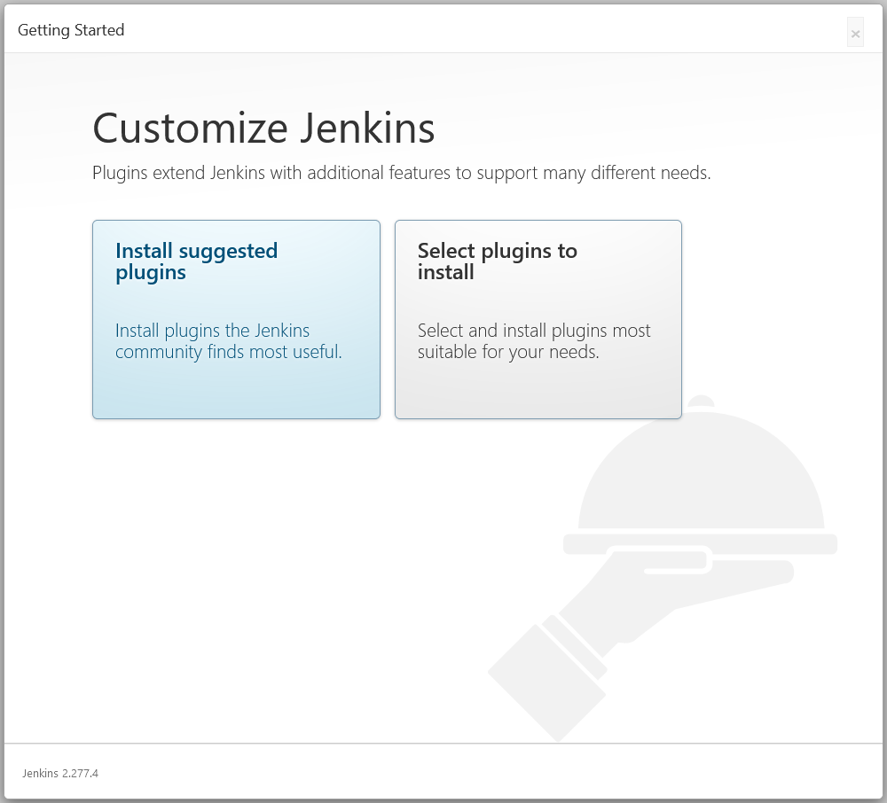
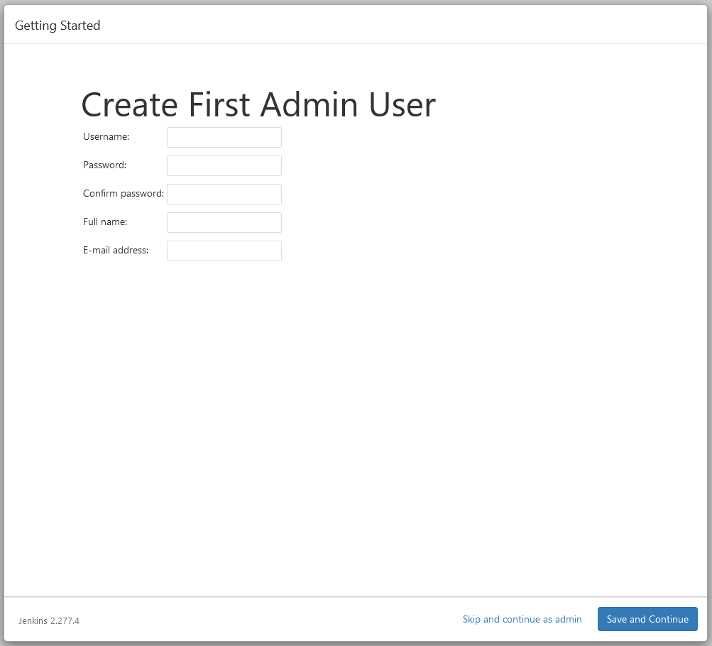
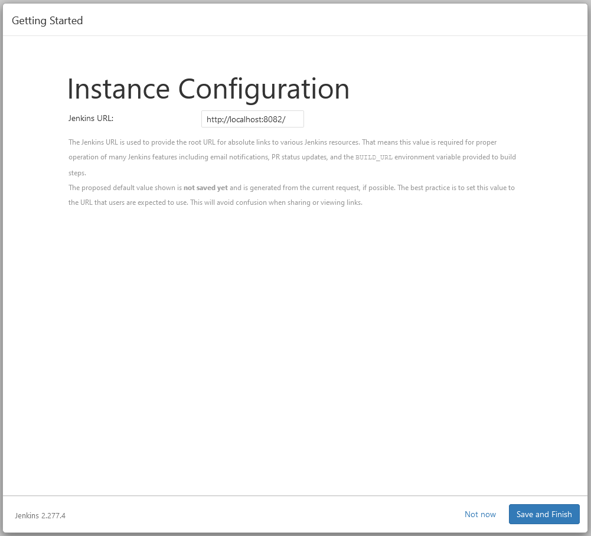
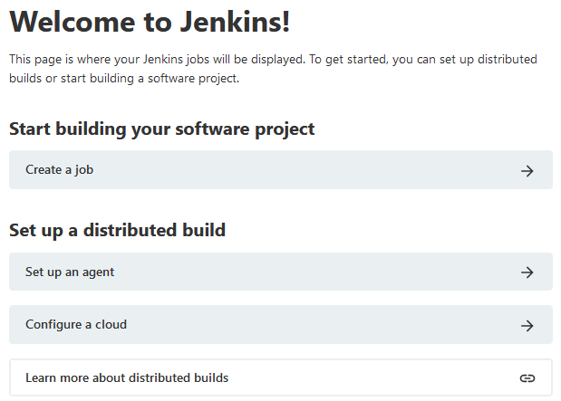
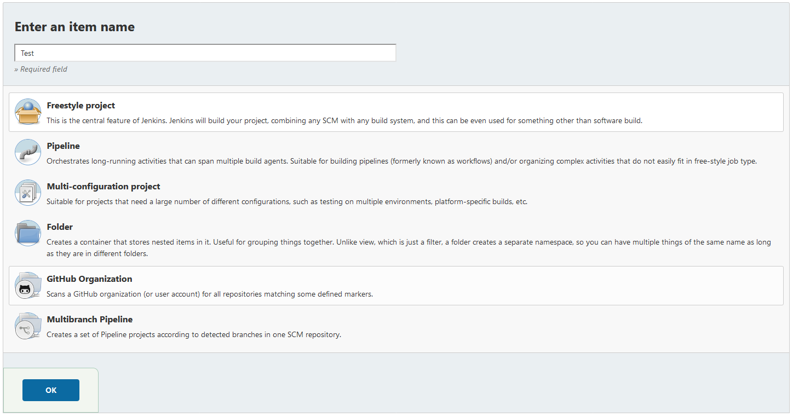
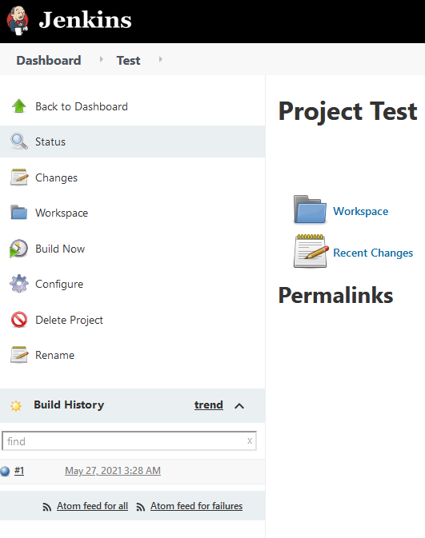
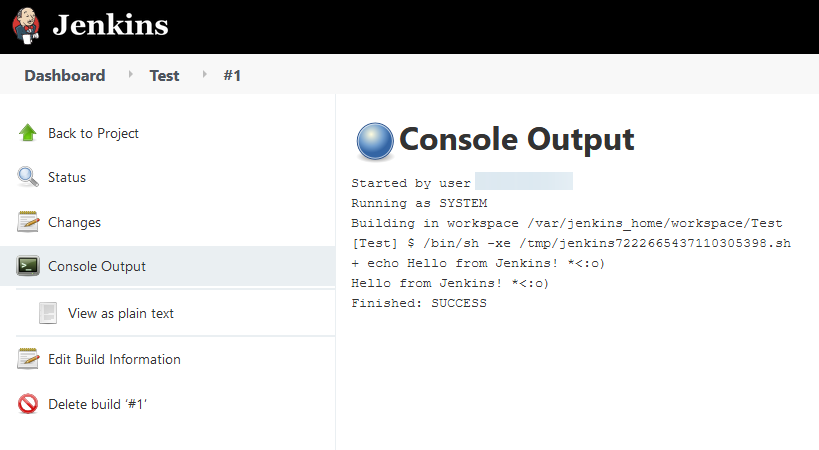

# Docker Jenkins Server

Project source from ["Running Jenkins and Persisting state locally using Docker" from Rangle.io](https://rangle.io/blog/running-jenkins-and-persisting-state-locally-using-docker-2/).

This project walks you through creating a [Jenkins Docker image](https://hub.docker.com/_/jenkins), initial Jenkins setup, and configuring a [Docker volume](https://docs.docker.com/storage/volumes/). The Docker volume allows you to keep your local Jenkins server configured as-is without needing to set it up all over again. This project assumes you have [Docker installed](https://docs.docker.com/get-docker/) on your machine.

1. Download the latest stabel Jenkins Docker image.

    ```bash
        docker image pull jenkins/jenkins:lts
    ```

2. Create a Docker volume on the local machine.

    ```bash
        docker volume create my-jenkins-volume
    ```

    * This is the *magic* that enables persistence of the local Jenkins server. Basically, this ensures the Jenkins data isn't lost.

3. Run the container with the volume attached and assign the container to a port.

    ```bash
        docker container run -d \
            -p [YOUR PORT]:8080 \
            -v my-jenkins-volume:/var/jenkins_home \
            --name jenkins-local \
            jenkins/jenkins:lts
    ```

    * Below is a succinct description of each flag:
        * `-d`: detached mode
        * `-v`: attach volume
        * `-p`: assign port target
        * `--name`: name of the container
    * After running this command, the Jenkins state is stored in `/var/jenkins_home` on the container instance. The optional argument passed with `-v` links the path `/var/jenkins_home` to the volume `my-jenkins-volume` which exists *locally*.

4. Run the following command to see the docker container running.

    ```bash
        docker ps
    ```

    * The Jenkins container instance will be running on `localhost:[YOUR PORT]`.

5. Get the initial administrator password for Jenkins.

    ```bash
        docker container exec \
            [CONTAINER ID or NAME] \
            sh -c "cat /var/jenkins_home/secrets/initialAdminPassword"
    ```

    * Copy the password from the terminal and paste it into the Jenkins web page.

6. After Jenkins is unlocked, install the suggested plugins.

    

7. When the installation is complete, create an admin user.

    

8. Don't make any changes to the URL and click **Save and Finish**.

    

9. Confirm Jenkins is persistent by creating a new job.

    

10. Call it "Test" and make it a **Freestyle project**.

    

11. Add a new **Shell Execution** under **Build**, add the command below, and click **Save**.

    ```bash
        echo "Hello from Jenkins! *<:o)"
    ```

12. Start the job by clicking **Build Now**.

    

13. Click on the blue ball (build status) under **Build History** to see the output of the build.

    

14. Destroy and ***completely remove*** the Jenkins Docker container.

    ```bash
        docker container kill [CONTAINER ID] && \
            docker container rm [CONTAINER ID]
    ```

    * Quickly confirm the Jenkins instance isn't running anymore by refreshing the Jenkins web page.

15. Run the same command used earlier to create the container instance in order to recover the Jenkins server and it's state.

    ```bash
        docker container run -d -p 8082:8080 \
            -v my-jenkins-volume:/var/jenkins_home \
            --name jenkins-local \
            jenkins/jenkins:lts
    ```

16. In a browser, navigate back to the Jenkins server web page and log in.

    * The job created earlier is still there as well as it's output.

17. (*Optional*) - Add a [**restart policy**](https://docs.docker.com/config/containers/start-containers-automatically/) to automatically start containers when they exit, or when Docker restarts.

    ```bash
        docker container run -d -p 8082:8080 \
            -v my-jenkins-volume:/var/jenkins_home \
            --name jenkins-local \
            --restart [no/on-failure/always/unless-stopped] \
            jenkins/jenkins:lts
    ```

    * Or, if it's already running...

    ```bash
        docker update \
            --restart [no/on-failure/always/unless-stopped] \
            [CONTAINER ID or NAME]
    ```
